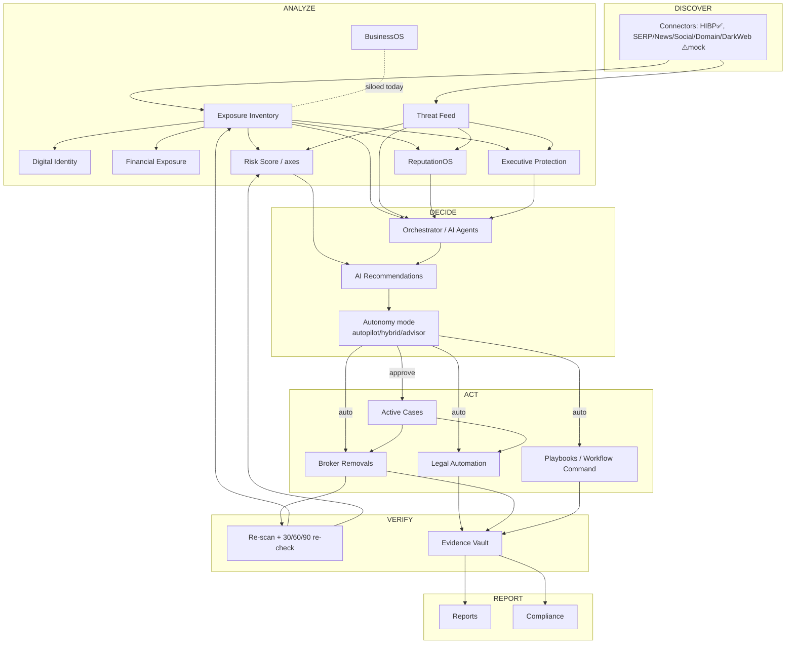

# PrivacyOS — Platform Orchestration Audit
**Lens: a buyer evaluating "one intelligent operating system," not an engineer reading code.**

---

## 0. The one-paragraph verdict

PrivacyOS already has the **organs** of a Digital Risk Operating System — a shared
Subject model, a real autonomous spine (the scheduler), deterministic scoring, and
~40 functional modules. What it lacks is **connective tissue**. Today the platform
reliably **Discovers** and **Analyzes**, but a large share of findings **dead-end
before Act → Verify → Report**. The autonomy that *would* make it feel like one OS is
real, but it is (a) only triggered by an external cron most tenants never wire up, and
(b) gated behind the six most expensive plans, so the personas who'd feel "it works
for me while I sleep" mostly never see it. The fix is not more modules. It is wiring
the existing ones into closed loops and surfacing the loop to every persona.

**Maturity by lifecycle stage (today):**

| Discover | Analyze | Decide | Act | Verify | Report |
|---|---|---|---|---|---|
| ●●●○ | ●●●○ | ●●○○ | ●○○○ | ●●○○ | ●●●○ |

The weakest link is **Act**: most "actions" are *recorded* (routing decisions, takedown
plans, playbook evaluations) rather than *executed*.

---

## 1. The lifecycle map (Discover → Analyze → Decide → Act → Verify → Report)

Every module should contribute to this loop. Here is where each one actually sits, and
where it stops short.

| Module | Discover | Analyze | Decide | Act | Verify | Report | Where it dead-ends |
|---|:--:|:--:|:--:|:--:|:--:|:--:|---|
| **Exposure Inventory** | ✅ | ✅ | ⚠️ | ⚠️ | ✅ | ✅ | Only *broker/legal* exposures get auto-actioned. News/social/forum/archive exposures are scored then wait for a human. |
| **Digital Identity** | ✅ | ✅ | ❌ | ❌ | ❌ | ✅ | Computes ATO risk but triggers no rotation/lockdown workflow. |
| **Financial Exposure** | ✅ | ✅ | ❌ | ❌ | ❌ | ✅ | Sub-score only; never opens a freeze/dispute case. |
| **Broker Removals** | ✅ | ✅ | ✅ | ✅ | ✅ | ✅ | **The one complete loop.** Autonomy-gated filing + 30/60/90 re-check + reappearance. |
| **Threat Feed** | ✅ | ✅ | ✅ | ⚠️ | ⚠️ | ✅ | Auto-opens cases (good); but the *case* then mostly waits for manual work. |
| **Active Cases** | – | ✅ | ⚠️ | ⚠️ | ✅ | ✅ | A case does **not** spawn its own removals/legal drafts; it's a tracking shell. |
| **Evidence Vault** | ✅ | ✅ | – | – | ✅ | ✅ | Read-only aggregation. Strong (hash seal, custody chain) but passive. |
| **AI Recommendations** | – | ✅ | ✅ | ⚠️ | – | ✅ | Approval → case is wired. Un-approved recs are regenerated forever (no nudge/expiry). |
| **ReputationOS** | ✅ | ✅ | ✅ | ⚠️ | ⚠️ | ✅ | Mention→recovery case is auto; suppression/SEO recovery is manual. |
| **Executive Protection** | ✅ | ✅ | ✅ | ⚠️ | ⚠️ | ✅ | Doxxing *routing* and risk *escalation* are computed and logged, not executed. |
| **BusinessOS** | ✅ | ✅ | ⚠️ | ❌ | ❌ | ✅ | Org assets are siloed from the Subject graph; findings rarely become cases. |
| **AI Agents** | ⚠️ | ✅ | ⚠️ | ⚠️ | – | ✅ | Mostly **advisory**. Real action lives in the scheduler, not the agents. |
| **Workflow Command** | – | – | ✅ | ⚠️ | ✅ | ✅ | Shows execution; playbook *steps* are evaluated but not executed. |
| **Legal Automation** | – | ✅ | ✅ | ✅ | ⚠️ | ✅ | **Real** LLM drafting — but drafts aren't auto-attached to the triggering case/evidence. |
| **Reports** | – | – | – | – | – | ✅ | Solid terminal stage. |
| **Compliance** | ✅ | ✅ | ❌ | ❌ | ⚠️ | ✅ | Audits frameworks; flags drift; never remediates. |

Legend: ✅ real · ⚠️ partial/recorded-not-executed · ❌ missing · – n/a

---

## 2. The dependency map — how it *should* interact as one OS

**Solid arrows = wired today.** The four highest-value missing links (dashed/absent in
code) are called out in §3.

### The shared backbone (what's right)
- **One `Subject` hub.** Exposures, threats, cases, removals, recommendations, mentions,
  incidents, scores all pivot on `subject_id`. This is the single most important
  "feels like one OS" asset and it already exists.
- **A real autonomy dial.** `autopilot / hybrid / advisor` with severity floors, with
  sensible per-plan defaults (business→advisor, executive→hybrid, personal→autopilot).
- **A real closed loop in Broker Removals** — the template every other module should copy.

### The backbone gaps
- **BusinessOS is a separate graph.** Org assets hang off `org_id`, with **no FK from
  Subject → Organization**. An exec who is also a founder is two unrelated worlds.
- **`credential_leaks` is triple-counted** across Identity, Financial, and Business with
  no canonical owner.
- **Org/news/social findings exist in two shapes** (Exposure *and* Mention) with no link.

---

## 3. The four buyer-visible "broken promises" (missing integrations)

These are the gaps a buyer *feels*, ranked by impact.

1. **A Case doesn't do the work it implies.** Opening a `data_broker_removal` case does
   **not** create the removal; opening a `legal_request` case does **not** attach a legal
   draft. Filings are exposure-driven and drafts are on-demand, so a case is a folder, not
   a worker. → *Wire Case → {Removal, Legal draft, Evidence} on creation.*
2. **Non-broker exposure is a dead end.** Search/social/forum/archive exposures are
   discovered and scored, then nothing. The buyer sees "we found it" with no "we're
   handling it." → *Route every exposure category to an action channel (delisting,
   platform report, suppression), not just brokers.*
3. **"Action" is often just a log entry.** Doxxing takedown *routing*, executive risk
   *escalation*, and playbook *steps* are computed and recorded but not executed. → *Make
   the recorded plan the thing that actually runs (auto in autopilot, queued in advisor).*
4. **Identity & Financial never act.** They produce excellent risk scores and then stop —
   no lockdown checklist, no freeze/dispute case, no credential-rotation workflow. → *Give
   them the same Discover→Act loop the brokers module has.*

**Plus one concrete defect to fix first:** code creates `executive_protection` cases, but
the Postgres `case_type` enum (migration `0001`, never altered) doesn't include that
value — those inserts will fail on live Supabase. *(verified across all migrations)*

---

## 4. The seven buyer journeys

Each starts from a real detected exposure/threat and follows what *should* light up.
`✅ wired` · `⚠️ partial` · `❌ missing`.

### 1) Individual — "My address showed up on a people-search site"
- Discover ✅ (broker connector) → Exposure Inventory ✅ → Score ✅ → autopilot files
  removal ✅ → 30/60/90 re-check ✅ → Report ✅.
- **Missing:** if the same record also leaked an email in a breach (HIBP ✅), Identity
  computes ATO risk ✅ but **never opens a "rotate password / enable 2FA" case ❌**. The
  two findings about the *same person* don't combine into one action. → *Auto-bundle
  address+credential into a single "lock down this identity" case.*

### 2) Family — "My teenager's school + photos are exposed"
- Discover ✅ → `family` exposure feeds the family axis ✅.
- **Missing:** family members are separate Subjects, but there is **no auto-fan-out ❌** —
  finding the parent's address doesn't auto-scan the spouse/kids at the same address.
  Minors get no stricter autonomy floor. → *Address/phone hit on one family Subject should
  auto-enqueue discovery for linked members; minors default to autopilot removal.*

### 3) Executive — "A fake LinkedIn + my home address are circulating"
- Discover ✅ → Executive Protection computes attack paths, doxxing routing, threat-actor
  cases ✅ (auto-opens `executive_protection`… **which fails on the enum bug ❌**).
- **Missing:** doxxing routes are *planned not executed ⚠️*; impersonation is *monitored
  not taken down ⚠️*; the attack-path "chokepoint" is identified but **not pushed to the
  top of the removal queue ❌**. → *Chokepoint → priority auto-file; impersonation →
  auto-draft platform takedown + evidence bundle.*

### 4) Public figure — "A deepfake of me is going viral"
- Discover ✅ → Deepfake agent opens a case ✅ → Reputation mention→recovery case ✅.
- **Missing:** evidence assembly for the deepfake is **stubbed ⚠️**; no auto-legal
  takedown draft attached; SEO/suppression recovery is manual ⚠️. → *Deepfake case →
  auto evidence seal + auto DMCA/platform-abuse draft + suppression playbook.*

### 5) Politician / Candidate — **no first-class persona ❌**
- Today a politician must buy the Reputation "Public Figure" plan ($499). There is **no
  politician/campaign Subject type, no coordinated-disinformation detection, no
  family+staff fan-out, no rapid-response war-room view.** Your homepage now *sells*
  "Politicians & Candidates" as a headline group — the product can't yet honor it.
  → *This is the single biggest persona gap and a packaging opportunity (see §9).*

### 6) Small business — "An employee's credentials leaked"
- Discover ✅ (org credential_leaks) → Business Intelligence indices ✅.
- **Missing:** org findings **rarely become cases ❌**, BusinessOS is **not linked to the
  owner's personal Subject ❌**, and there's no auto-notify-employee / force-rotation
  flow ❌. → *Org leak → auto-case + employee notification + (with consent) personal-side
  protection upsell.*

### 7) Enterprise — "Coordinated brand impersonation + exec targeting"
- Discover ✅ → Domains/third-party/employee modules ✅ → Compliance posture ✅.
- **Missing:** Compliance flags drift but **never remediates ❌**; no cross-tenant
  executive roll-up; automation exists but requires manual workflow authoring. The
  enterprise buyer wants a **board report that writes itself from closed loops** — today
  the loops aren't closed enough to populate it autonomously. → *Compliance finding →
  remediation case; exec roll-up dashboard; auto-board-report from the cycle.*

---

## 5. Automation opportunities (ranked by value × effort)

| # | Automation | Lifecycle link added | Effort | Buyer payoff |
|---|---|---|---|---|
| 1 | **Case → spawns its own work** (removal/legal/evidence on open) | Decide→Act | M | Cases stop being empty folders |
| 2 | **Every exposure category → an action channel** (not just brokers) | Analyze→Act | M | "We found it" becomes "we're removing it" |
| 3 | **Execute recorded plans** (doxxing routes, playbook steps) under autonomy gate | Decide→Act | M–L | The platform actually *does* things |
| 4 | **Identity/Financial lockdown loops** (rotation, freeze, dispute cases) | Analyze→Act→Verify | M | Two strong modules start protecting, not just scoring |
| 5 | **Family / org fan-out discovery** from one hit | Discover→Discover | S | One scan protects the whole household/company |
| 6 | **Compliance finding → remediation case** | Analyze→Act | S | Audits become outcomes |
| 7 | **Recommendation lifecycle** (nudge, expire, auto-act on aging low-risk) | Decide | S | No more infinite un-actioned recs |
| 8 | **Make the scheduler self-driving in-app** (don't depend only on external cron) | all | S | Autonomy actually runs for everyone |

---

## 6. High-value workflows to ship (closed loops, end to end)

1. **"Lock down my identity"** — credential leak + PII exposure → single case → guided
   rotation + 2FA + broker removals + freeze recommendation → re-check → score lift.
2. **"Kill the impersonation"** — fake profile/deepfake → evidence seal → auto legal/platform
   takedown draft → submission tracking → suppression → verify gone → report.
3. **"Protect my family in one click"** — one address hit → fan-out scan of all members →
   per-member autopilot removals (minors strictest) → family report.
4. **"Campaign war room"** (politician) — coordinated-narrative detection → rapid-response
   cases for candidate + family + staff → legal + platform takedowns → daily brief.
5. **"Employee breach response"** (business) — org leak → auto-case → notify employee →
   force rotation → optional personal-side protection → compliance evidence.
6. **"Board-ready risk report"** (enterprise) — the cycle's closed loops auto-populate a
   monthly board report + compliance posture with zero analyst effort.

---

## 7. Features that should be **merged** (de-duplicate the surface)

The platform has 40+ menu items; several model the same thing twice.

- **Exposure (source=news) ⇄ ReputationOS Mention** → one canonical "signal" with a
  reputation view, not two records of the same article.
- **`credential_leaks` across Identity / Financial / BusinessOS** → one canonical leak
  entity, projected into three lenses (don't store/score three times).
- **Removal status ⇄ Exposure status** → keep them in sync (filing a removal should move
  the exposure), today they drift.
- **Cases ⇄ Incidents** (ExecutiveOS `incidents` vs core `cases`) → one case spine with a
  type, not two parallel queues (`/cases`, `/incidents`).
- **Threat `acknowledged` flag ⇄ `threat_investigations` trail** → acknowledgment should
  *mean* the investigation is closed; today they're independent.
- **Navigation:** "Overview / Protection / Protection Suite / Mission Control" are four
  top-level dashboards that overlap heavily → consolidate to **one** adaptive command
  center. Fewer doors = "one OS."

---

## 8. Features that should become **autonomous** (move from advisory to acting)

The agents are mostly advisory and the real work is in the scheduler — so make the
scheduler do more, gated by the autonomy dial that already exists.

- **Broker filing** ✅ already autonomous — the model to copy.
- **Should be autonomous next (autopilot) :** non-broker delisting/platform reports;
  identity rotation prompts; family fan-out scans; compliance remediation tickets;
  recommendation aging → auto-act on low-risk.
- **Should be autonomous-with-gate (hybrid/advisor):** legal takedown submission;
  doxxing route execution; financial freeze/dispute initiation; impersonation takedown.
- **Keep human-in-loop (advisor floor):** anything legally binding for businesses,
  anything touching a minor's record without guardian confirm, irreversible disputes.
- **Critically:** give every plan a *visible* "while you were away" feed of what ran
  autonomously. Autonomy you can't see doesn't sell.

---

## 9. Revenue unlocked by deeper orchestration

1. **First-class Politician / Campaign tier** — the persona you now advertise has no
   product. A "Campaign Protection" SKU (candidate + family + staff seats, war-room,
   rapid response, disinformation detection) is a high-ACV, seasonal, referenceable
   segment. *Biggest single opportunity.*
2. **Autonomy as the upsell axis, not features.** Today automation is gated to 6 top
   plans, so most users never feel the OS. Instead, sell **"we do the work"** by giving
   every tier *some* autopilot and charging for *more* autonomy + faster SLAs. Converts
   on the exact promise your homepage makes.
3. **Identity & Financial lockdown loops = new attach revenue.** Turning two scoring
   screens into acting workflows justifies the "premium/financial" tier and reduces churn
   (visible saves).
4. **Family fan-out = seat expansion.** One hit auto-revealing household risk is the most
   natural path to the $99 Family plan.
5. **Business → personal cross-sell.** Linking Org to owner/employee Subjects opens
   compliant personal-protection upsell to every protected employee.
6. **"Board report that writes itself"** is an enterprise procurement closer — but only
   once the loops are closed enough to populate it autonomously.

---

## 10. Recommended sequence (build order)

1. **Fix the `executive_protection` enum** (latent insert failure). *(hours)*
2. **Close Case → {Removal, Legal, Evidence}** and **Exposure → action channel**. *(the
   two changes that most make it "feel like one OS")*
3. **Execute recorded plans** under the existing autonomy gate + add the "while you were
   away" feed to every plan.
4. **Identity & Financial lockdown loops.**
5. **Family/org fan-out + canonical de-duplication (signals, credential leaks).**
6. **Politician/Campaign persona + tier.**
7. **Compliance remediation + auto board report.**

> The goal is orchestration, not features: every item above *connects existing modules*
> into closed Discover→…→Report loops rather than adding new surface area.
